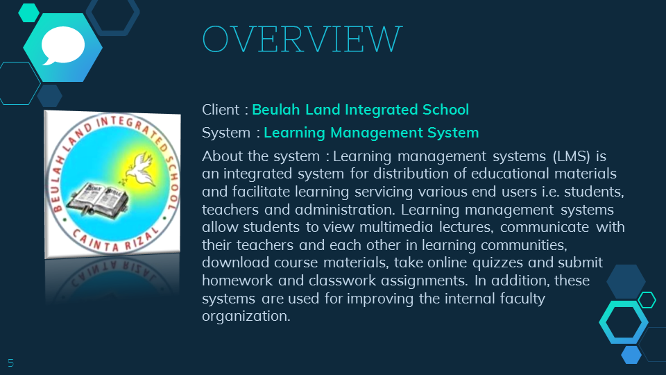
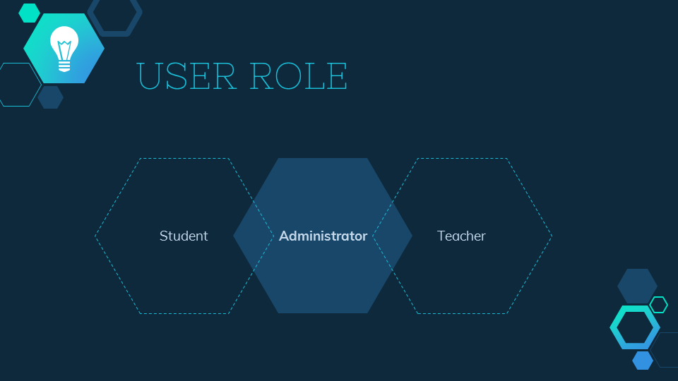
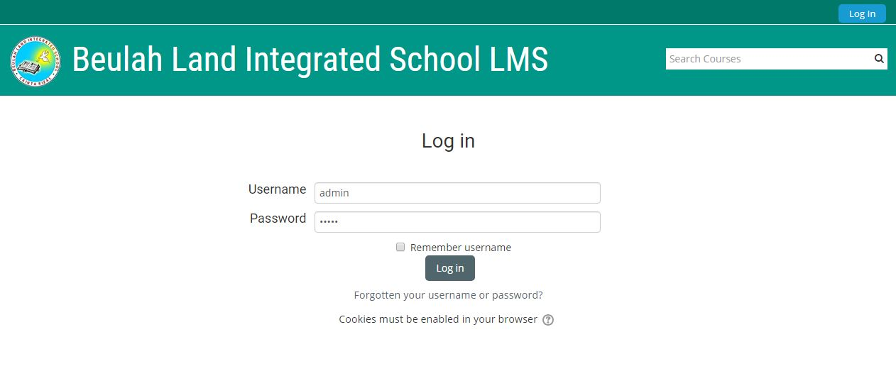
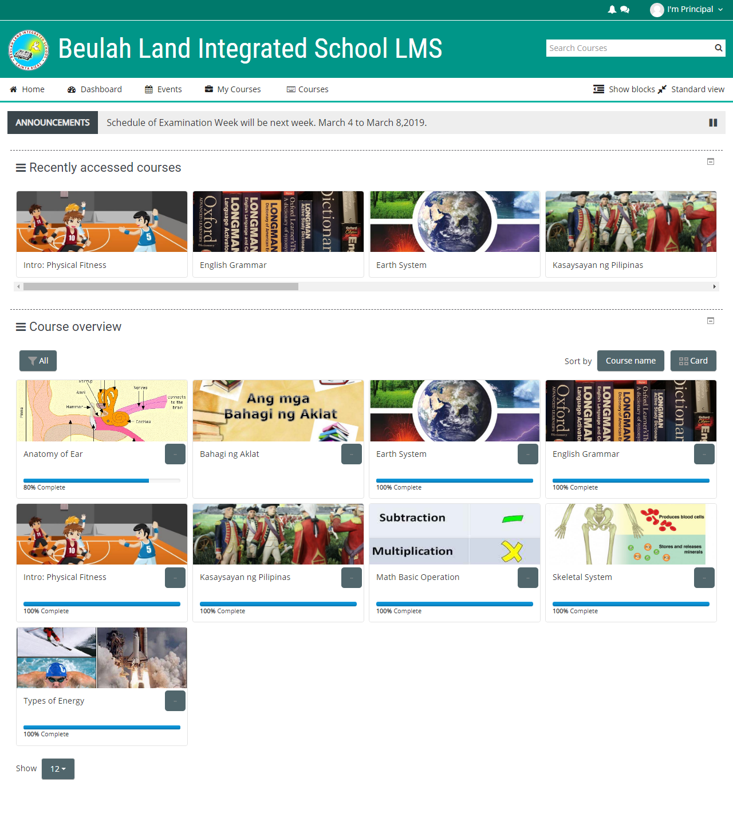
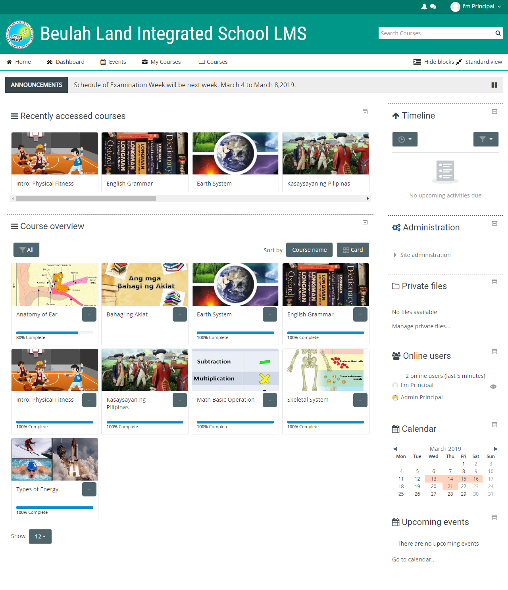

# Beulah Land Integrated School Learning Management System

Project for Object Oriented Programming II  under Engr. Belinda Bunag





## Getting Started

These instructions will get you a copy of the project up and running on your local machine for development and testing purposes. See deployment for notes on how to deploy the project on a live system.

## Installation
```
> The database is located in database/blislms.sql
```

```
> Open localhost/phpmyadmin and import the sql file
```

```
> Go to localhost/blislms then login using 
Username: admin
Password: Admin#123
```
### •Landing Page


### •Login


### •Dashboard and Admin View



## License

This project is licensed under GNU General Public License v3.0 - see the [LICENSE](https://github.com/stnbnvdz/BLIS-LMS/blob/master/COPYING.txt) file for details

## Authors


